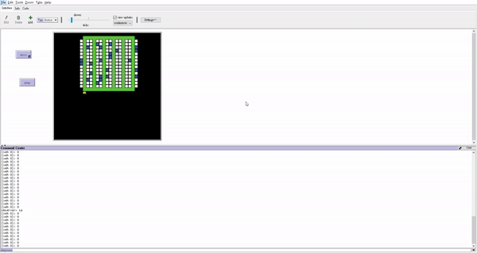

# Picking_S

This is an Implemntation of [Order Picking Problem](https://en.wikipedia.org/wiki/Order_processing) in Netlogo with S-shape strategy.

Visualize and be able to find travel distance of order picking.

[Here](picking.gif) is the Demo

